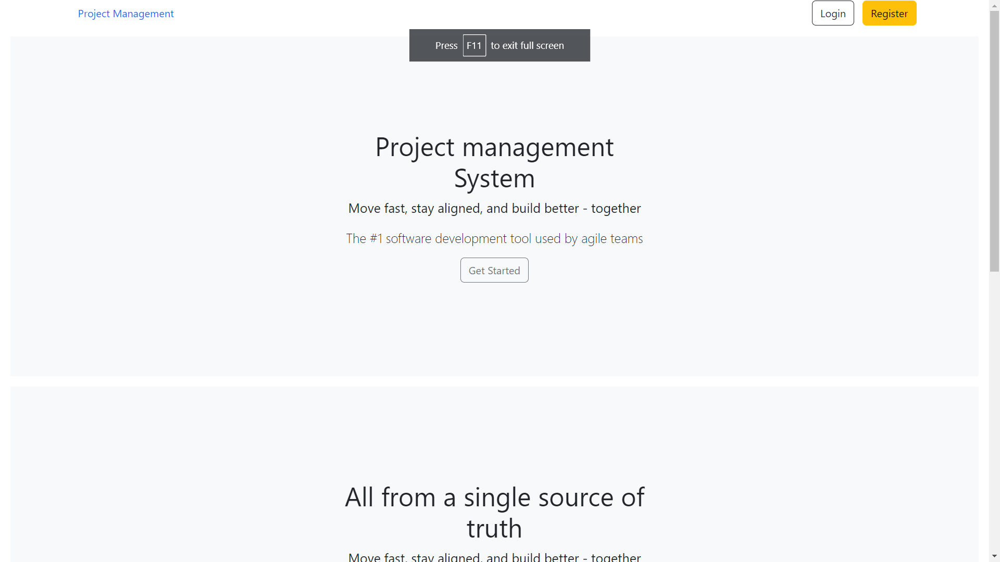

## Project Management System

## Dependencies
- Python

## How to run the code
1. Install Virtualenviormnet in your system
2. Run `pip install -r requirements.txt`
3. Run `python manage.py migrate`
4. Run `python manage.py runserver`

